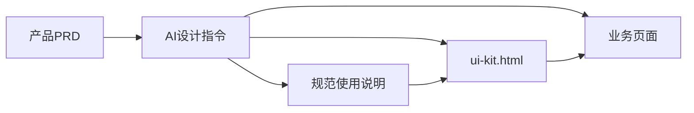

# NotaSign UI 规范引用说明

> **通用入口**：给人类、Cursor、Claude、ChatGPT、通义、豆包等任意 AI 工具说明如何引用 NotaSign UI 规范、如何从 PRD 生成页面、如何扩展组件与模板。

## 规范引用包

推荐把下列文件作为一个 **NotaSign UI 规范引用包** 交给同事或 AI。不同 AI 软件不需要支持 Cursor 的技能机制，只要能读取文件或粘贴内容即可。

| 读取顺序 | 文件 | 职责 | 非 Cursor AI 使用方式 |
| --- | --- | --- | --- |
| 1 | [ui-kit.html](../ui-kit.html) + [notasign-design-system.css](../notasign-design-system.css) | 组件 DOM 结构、视觉样例、`--ns-*` token、可调用的真实示例 | 上传 / 粘贴相关组件区块 |
| 2 | 本文档 | 引用边界、生成流程、页面类型策略、扩展与自检 | 作为系统提示或项目规范粘贴 |
| 3 | [.cursor/skills/notasign-ui-architect/SKILL.md](../.cursor/skills/notasign-ui-architect/SKILL.md) | AI 设计指令：PRD 解析、交互补全、组件选型、交付标准 | 作为“AI 角色说明”粘贴；不依赖 Cursor |

辅助索引（非主入口）：

- [components.md](./components.md) — 组件字典（类名、data 属性、脚本依赖）
- [templates/](./templates/) — 典型页面**案例**（列表页等），有匹配时优先复用
- [ai-prompts.md](./ai-prompts.md) — 可复制 Prompt 片段



## 仓库分层

```text
notasign-design-system.css   # token + 组件样式（SSOT）
ui-kit.html                  # 活体规范 + 可视化文档
components/*.js              # 行为与业务组件渲染
pages/*                      # 可运行典型页面 / 新业务页
docs/                        # 说明、索引、模板案例
.cursor/skills/              # Cursor 专用存放位置；内容也可复制给其他 AI
.cursor/rules/               # 红线与专项自检（HTML、token、列表页等）
```

## 从 PRD 生成页面（标准流程）

1. **读 PRD**：用户角色、主任务、数据实体、关键操作、异常与权限。
2. **判页面类型**（见下节）：列表 / 设置 / 发起流程 / 详情 / 结果 / 弹层等。
3. **查 UI Kit**：在 `ui-kit.html` 找到对应组件区块，确认非 `pending`、非置灰。
4. **查组件索引**：[components.md](./components.md) 确认 class、`data-*`、JS 依赖。
5. **选模板案例**：`docs/templates/` 有同类型页面则复用骨架与 `pages/*.html`；无则按 UI Kit 组合。
6. **输出**：`pages/<slug>.html` + 页面 CSS + 页面 JS；业务组件用 **mount point**，不复制内部 DOM。
7. **自检**：本文「通用自检」+ 模板专项规则 + `.cursor/rules/*.mdc`。

## 页面类型策略

AI 应根据 PRD **自行组合**组件，不必等每种页面都有模板。模板只是加速参考。

| 类型 | 典型特征 | 优先组件 / 布局 | 案例 |
| --- | --- | --- | --- |
| **列表页** | 筛选 + 表格 + 分页 | Topbar、Sidebar、`ns-app__filters`、Table mount、Pagination | [templates/list-page.md](./templates/list-page.md)、`pages/signing-list.html` |
| **设置页** | 分组表单、开关、说明文案 | Form、Input、Select、Switch（UI Kit 有则调用）、Section 标题 | [templates/settings-page.md](./templates/settings-page.md)、`pages/send-settings.html` |
| **发起 / 流程页** | 多步、表单、主操作 CTA | Steps（若有）、Form、Button primary、侧栏或顶栏 | 待增 `templates/flow-page.md` |
| **详情页** | 只读信息 + 次要操作 | 描述列表、Tag、Button muted | 按 UI Kit 组合 |
| **结果页** | 成功 / 失败反馈 | `ns-result`、`ns-btn` | `ui-kit.html#result` |
| **弹窗 / 抽屉** | 局部任务 | Modal / Drawer（UI Kit 可调用示例） | 不替代整页骨架 |

**布局壳层**（多数后台页共用）：

- `body.ns-app` → 顶栏 mount → `.ns-app__body` →（可选）侧栏 mount → `main.ns-app__content`
- 视口：`height: 100vh`，禁止 `body` 纵向滚动；可滚动区用 `flex: 1` + `min-height: 0` + `overflow`

## 组件调用规则

### 可调用的

- `ui-kit.html` 中**可见、非置灰**示例
- 标注 `[AI 规范]` 或已在 [components.md](./components.md) 登记的组件
- 业务组件：仅 **mount point**（如 `data-ns-business-topbar`），由 `components/*.js` 渲染

### 禁止调用的

- `data-foundation-status="pending"`
- `data-callable="false"`、`ns-kit-demo--disabled-library`
- `ns-kit-icon-cell--missing`、placeholder 图标
- 标注「建设中 / 禁止调用」的示例

### 基础组件 vs 业务组件

| 层级 | 页面里怎么做 |
| --- | --- |
| **基础组件** | 从 UI Kit **复制 DOM 结构**（class、层级），只改文案、`data-*`、`aria-*` |
| **业务组件** | 只写 `<div data-ns-business-...>`，**禁止**复制 Topbar / Table 等内部 HTML |

### 样式

- 禁止 `style="..."`
- 禁止业务页写死 Hex / 随意 px
- 使用 `var(--ns-*)` 与已有 `ns-*` class
- 页面 CSS 只管布局与组合，不改基础组件内部样式

## 交互生成规则

| 场景 | 要求 |
| --- | --- |
| 搜索 | `data-search-input`、`data-search-clear`，`components/input.js` |
| 下拉筛选 | `data-ns-select`，`components/select.js` |
| 分页 | `data-ns-pagination`，事件 `notasign:paginationchange` |
| 浮窗 / 菜单 | `data-flyout-trigger`、`data-flyout`；表格 more 边界 `.ns-table-container` |
| Tab | `data-ns-tabs`，`components/tabs.js` |
| 隐藏 | `hidden` 属性，不用仅靠 CSS 藏顶栏浮层 |
| 加载 / 空 / 错 | `ns-spin`、`ns-empty`、`ns-alert`；列表见 [list-page-states.md](./templates/list-page-states.md) |
| 禁用 | `disabled` 或 `ns-btn--disabled` / `ns-input--disabled` |
| i18n | 可见文案：`data-i18n`、`data-i18n-placeholder`、`data-i18n-label` |
| 无障碍 | 保留 `aria-*`、`role`、键盘焦点样式 |

## 扩展规范（新增 token / 组件 / 模板）

| 变更 | 必须同步 |
| --- | --- |
| 新 `--ns-*` token | `notasign-design-system.css`、`ui-kit.html` 样例、[components.md](./components.md) |
| 新基础组件 | `ui-kit.html`、`notasign-design-system.css`、`docs/foundation/README.md`、`components.md` |
| 新业务组件 | `components/<name>.js`、`docs/business/README.md`、`components.md` |
| 新典型页面案例 | `pages/<slug>.*`、`docs/templates/<type>-page.md`、`templates/README.md` |
| 新图标资产 | `pages/assets/<page>/`，UI Kit Icons 区登记 callable |

新增前：若 UI Kit 无对应组件，**先询问是否沉淀进规范**，不要先在业务页发明 class。

## 通用交付自检

生成或修改任意业务页前确认：

- [ ] 已读 `ui-kit.html` 相关组件区块
- [ ] 无内联 style、无硬编码 Hex、无自造 class
- [ ] 未使用 pending / 禁止调用示例
- [ ] 业务组件为 mount point，未复制内部 DOM
- [ ] 脚本依赖齐全，`i18n.js` 优先于其他组件脚本
- [ ] 文案有 `data-i18n*`
- [ ] 整页滚动契约正确（`100vh`、`min-height: 0`）
- [ ] PRD 中的异常态（空、加载、错、无权限）有对应 UI

**列表页**额外对照：[templates/list-page.md](./templates/list-page.md)、`.cursor/rules/notasign-list-page-generation.mdc`。

## 给 AI 的通用引用提示

```text
请按 NotaSign UI 规范引用包生成页面：
1. 先读取 ui-kit.html 与 notasign-design-system.css，确认组件 DOM、视觉 token 和可调用示例；
2. 再读取 docs/notasign-spec-usage.md，遵守页面类型、组件调用、交互和自检规则；
3. 如可读取 .cursor/skills/notasign-ui-architect/SKILL.md，请把它作为 AI 设计指令；
4. 根据 PRD 生成可运行 HTML/CSS/JS。有模板案例则复用；没有模板则组合 UI Kit 组件；
5. 禁止内联 style、硬编码 Hex、自造 class、调用 pending 或禁用示例。
```

## 相关链接

- [docs/README.md](./README.md) — 文档导航
- [ai-prompts.md](./ai-prompts.md) — Prompt 模板
- [templates/README.md](./templates/README.md) — 页面案例索引
